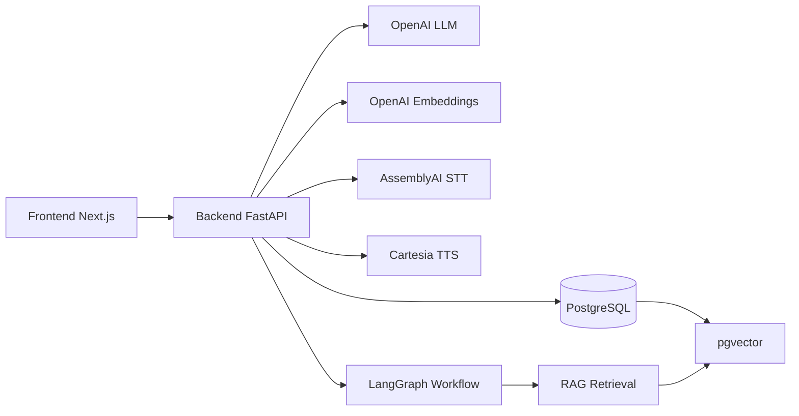

# High Level System Design

## Problema

Las entrevistas tecnicas manuales consumen tiempo, dependen de criterios variables y dificultan comparar candidatos con evidencia consistente. El sistema automatiza una entrevista tecnica por voz usando CV, descripcion del puesto, RAG y evaluacion estructurada.

## Objetivo

Construir una aplicacion web full stack donde un entrevistador cree entrevistas, cargue CV y vacante, y un candidato responda por voz. El sistema transcribe, mantiene contexto, genera preguntas dinamicas y produce un reporte final validado.

## Arquitectura

## Componentes

- Frontend: Next.js, TypeScript, TailwindCSS. Incluye dashboard de entrevistador y pantalla de entrevista por voz para candidato.
- Backend: FastAPI, SQLAlchemy y Pydantic. Expone rutas REST para entrevistas, documentos, audio, transcripciones y reportes.
- Base de datos: PostgreSQL con `pgvector`. Guarda entrevistas, documentos, transcripciones, estados de workflow, embeddings y reportes.
- RAG: extrae texto de CV/vacante, normaliza contenido, crea chunks, genera embeddings y ejecuta busqueda semantica.
- Agente: LangGraph orquesta ingesta RAG, recuperacion de contexto, perfilado, generacion de preguntas, evaluacion y reporte.
- Audio: AssemblyAI convierte voz a texto. Cartesia genera audio del entrevistador cuando se usa el flujo de voz backend.
- Structured output: Pydantic valida perfiles, preguntas, evaluaciones, decisiones y reporte final.
- Tool calling: LangChain tools calculan skills, score tecnico, seniority y feedback.

## Flujo General

1. El entrevistador crea una entrevista.
2. El sistema recibe CV y descripcion de puesto.
3. El backend extrae texto, crea chunks, genera embeddings y almacena vectores.
4. LangGraph inicia la entrevista y recupera contexto semantico de CV y vacante.
5. El LLM genera preguntas tecnicas adaptadas al candidato y al puesto.
6. El candidato responde por voz.
7. AssemblyAI transcribe la respuesta.
8. El workflow evalua la respuesta, decide si profundiza o avanza, y mantiene memoria conversacional.
9. Al finalizar, el sistema genera un reporte estructurado con puntuaciones, fortalezas, debilidades y recomendacion.

## Decisiones Tecnicas

- `pgvector` evita depender de un servicio externo de vector store y mantiene datos academicos en una sola base.
- LangGraph permite demostrar workflow con estado, nodos separados y persistencia propia.
- Pydantic se usa como contrato de structured output para evitar respuestas libres inconsistentes.
- La transcripcion se guarda como fuente de auditoria y como memoria conversacional.
- El reindexado RAG se ejecuta al iniciar el workflow para asegurar que CV y vacante tengan embeddings actualizados.

## Limitaciones

- El sistema depende de credenciales externas de OpenAI, AssemblyAI y Cartesia.
- La calidad del reporte depende de la calidad del CV, la vacante y la transcripcion.
- Los checkpoints son persistidos en tabla propia `workflow_states`, no con un checkpointer nativo de LangGraph.
- OCR de PDF escaneado requiere OpenAI y solo procesa un numero limitado de paginas.

## Mejoras Futuras

- Agregar checkpointer nativo de LangGraph.
- Incorporar rubricas configurables por empresa o curso.
- Exportar reportes a PDF.
- Agregar panel de comparacion entre candidatos.
- Incluir analisis de voz adicional, como pausas o claridad, si la rubrica lo permite.
